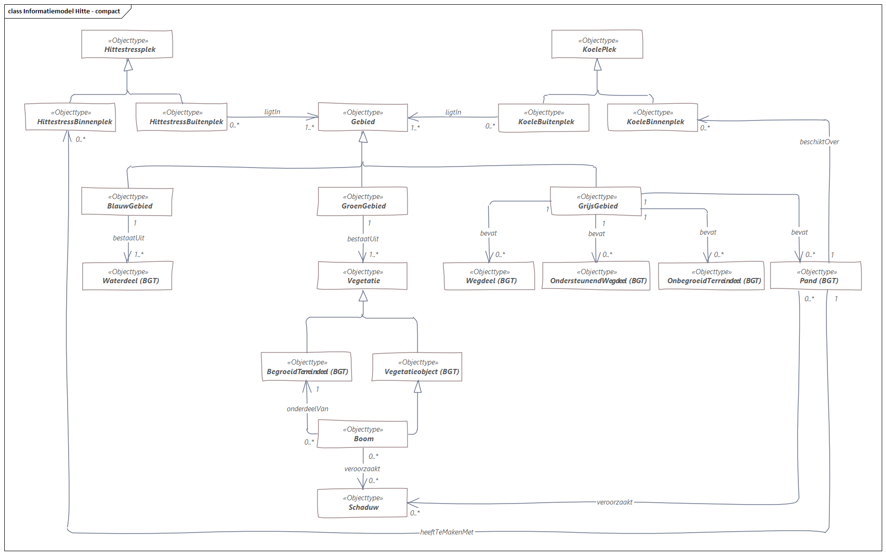
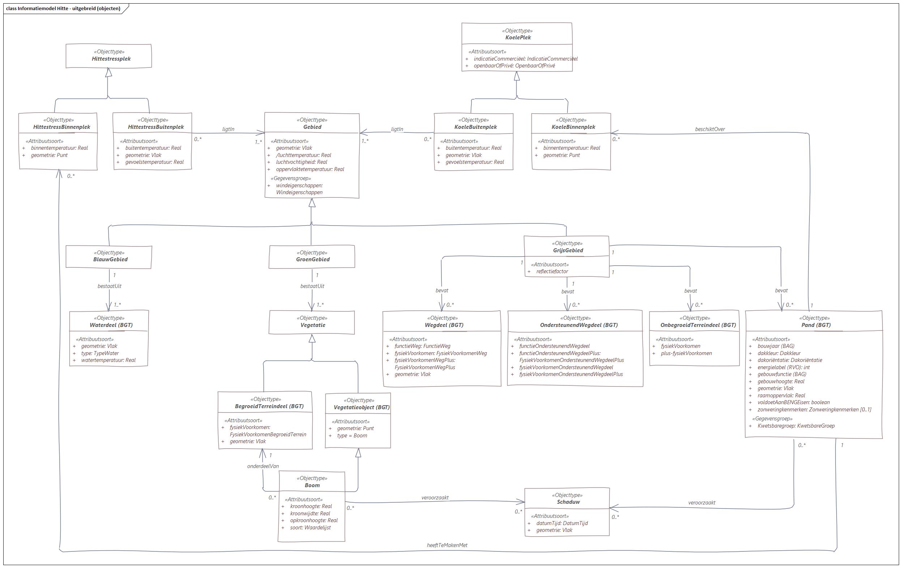

# Toelichting

## Het woordenboek Hitte

### Inhoud

Het Woordenboek Hitte bevat termen en definities die te maken hebben met het thema 'hitte' binnen het bredere thema 'klimaatadaptatie'. De focus ligt daarbij vooral op termen rondom kortdurende hitte in het stedelijk gebied (dat wil zeggen, hittegolven en alles wat daarmee te maken heeft). Maar ook enkele termen die meer te maken hebben met globale, geleidelijke opwarming en de effecten daarvan, zijn meegenomen. De termen hebben te maken met de fysieke omgeving (inclusief gebouwen), gezondheid van mens en dier, weer- en klimaatverschijnselen, effecten van hitte op mens en natuur, en relevante instrumenten en maatregelen om de negatieve effecten van hitte te bestrijden. Waar mogelijk zijn begrippen in dit woordenboek gekoppeld aan vergelijkbare termen uit andere, vergelijkbare woordenboeken zoals het Aquo.

### Totstandkoming

Het woordenboek is in opdracht van het ministerie van Infrastructuur en Waterstaat gemaakt door Geonovum, samen met een werkgroep met leden vanuit relevante organisaties in het werkveld. Met de werkgroep hebben we de relevante termen geselecteerd, geordend en gedefinieerd. Middels open reviewsessies hebben we commentaar uit een bredere groep stakeholders verzameld en verwerkt. 

### Inhoudelijke keuzen

Er is voor gekozen om het woordenboek zo breed op te stellen als mogelijk binnen de tijd die er was. Het bevat zo'n 230 termen, die geordend zijn in een hiërarchische structuur en gegroepeerd in (hopelijk) intuïtieve collecties. Daarnaast is het woordenboek alfabetisch en via een zoekfunctie te raadplegen. 

Er was geen tijd om alle woorden van een compleet uitgewerkte definitie te voorzien. Daarom zijn veel termen gedefiniëerd op basis van Van Dale of Wikipedia. Waar mogelijk is een betere bron gebruikt zoals de website van het KNMI, de klimaateffectatlas of het HvA rapport "De hittebestendige stad". Aan sommige definities is meer aandacht besteed omdat uit discussies in de werkgroep bleek dat dit belangrijke termen waren. 

Dit geldt bijvoorbeeld voor de term [Koele plek](http://definities.geostandaarden.nl/imka/id/begrip/koele_plek) (inclusief  gerelateerde termen zoals schaduwplek, hittestressplek, afstand tot koele plek, koele binnenruimte/buitenruimte), en voor [Gevoelstemperatuur](
http://definities.geostandaarden.nl/imka/id/begrip/gevoelstemperatuur). Ook de definitie van vegetatie-begrippen zoals [Boom](http://definities.geostandaarden.nl/imka/id/begrip/boom) heeft extra aandacht gehad, vanwege de belangrijke rol van groen bij hittebestrijding in steden. Ook termen zoals [Hittesterfte](http://definities.geostandaarden.nl/imka/id/begrip/hittesterfte) zijn wat beter bekeken.

### Aanbevelingen voor vervolg

Het woordenboek is in korte tijd samengesteld en slechts een aanzet tot een potentieel volledige collectie juist gedefinieerde termen. Een logisch vervolg zou dan ook zijn om het woordenboek verder aan te vullen, de definities te verbeteren op basis van goede bronnen, en waar mogelijk aan te sluiten bij internationale standaarden; dit in samenwerking met het werkveld zodat er een breed gedragen woordenboek ontstaat. De aanbeveling is echter wel om dit te doen vanuit concrete use cases. Dit zorgt voor de juiste focus en context. 

Daarnaast kan het woordenboek de basis vormen voor een informatiemodel. Hier geldt nog sterker dat concrete use cases het startpunt moeten zijn. Een informatiemodel kan concreet en exact beschrijven welke gegevens nodig zijn voor een specifieke use case en kan de basis zijn voor uniforme, interoperabele informatieuitwisseling. Vanuit het informatiemodel wordt terugverwezen naar het woordenboek. Als in het informatiemodel bijvoorbeeld het objecttype 'Gebouw' voorkomt, verwijst dit terug naar de definitie van Gebouw in het woordenboek. 

## Het conceptuele model

In het algemeen definieert een conceptueel informatiemodel welke 'onderwerpen van gesprek' ('concepten', 'dingen’) worden onderscheiden in een bepaald domein. Wat betekenen zij, hoe verhouden ze zich tot elkaar en welke informatie is daarvan relevant? Deze informatie wordt gemodelleerd als informatieobjecten met kenmerken.

Het informatiemodel dient als taal waarmee domeinexperts kunnen communiceren met informatieanalisten en verschaft een eenduidige interpretatie van die werkelijkheid ten behoeve van deze communicatie. Hieronder een korte toelichting op het conceptueel informatiemodel hitte.

### Inhoud

Het conceptueel informatiemodel hitte voromt een eerste aanzet. Het uitgangspunt is de informatie die overheden nodig hebben om een hittestresstest uit te voeren. Zij zijn verplicht deze testen iedere 6 jaar te [actualiseren](https://klimaatadaptatienederland.nl/stresstest/#:~:text=In%20het%20Deltaplan%20Ruimtelijke%20Adaptatie%20is%20afgesproken%20dat%20overheden%20de%20stresstest%20iedere%206%20jaar%20actualiseren%20omdat%20de%20kwetsbaarheden%20in%20de%20loop%20der%20tijd%20kunnen%20veranderen.). Het model faciliteert eenduidige en uniforme informatie-uitwisseling over hittestress op basis van mogelijke afspraken rondom inhoud, betekenis en samenhang.

De belangrijkste objecten in het huidige model zijn:

 - `Koele plek` (verder uitgesplitst in: `binnen` en `buiten`)
 - `Hittestressplek`  (verder uitgesplitst in: `binnen` en `buiten`)
 - `Schaduw` 
 - `Gebied` (verder uitgesplitst in: `grijs` [bebouwd], `groen` [begroeid] en `blauw` [water])

Hier weergegeven in een compacte versie van het informatiemodel hitte:
<!--  -->

### Totstandkoming
   
Het conceptuele informatiemodel hitte is gemaakt **in opdracht van het ministerie** van Infrastructuur en Waterstaat door Geonovum. Het resultaat is gebaseerd op de bevindingen uit de werkgroep en gesprekken met andere relevante organisaties uit het veld die rondom het woordenboek hitte zijn georganiseerd.

Voor een volwaardig conceptueel informatiemodel is een verdere uitwerking noodzakelijk. Belangrijk is om exact te weten welke informatie partijen in het werkveld willen uitwisselen over hittestress (_use cases_). In dit stadium ontbreekt dat beeld nog goeddeels. Maar, op basis van de werksessies rondom het woordenboek hitte tekenden zich gaandeweg de eerste contouren af.

Deze huidige versie van het model geeft de meest relevant informatie-objecten weer, inclusief de bijbehorende eigenschappen en onderlinge relaties tussen de objecten. Door de informatiestructuur te visualeren, ontstaat een scherper beeld van de behoeften, mogelijkheden en eventuele 'kennisgaten'.

### Inhoudelijke keuzen

Het stappenplan in de bijsluiter voor de stresstest hitte vormt de basis van dit informatiemodel:

 1. Bekijk de kaart met :
    - (a) het _aantal warme nachten_ in de Klimaateffectatlas en
    - (b) de _gevoelstemperatuur_ in de Klimaateffectatlas.

 2. Overweeg ieder gevolg uit de **mindmap hitte** te overwegen. Speelt dat gevolg hier? Is de blootstelling relevant? Zo ja:

    - Waar speelt het?
    - Welke factoren beïnvloeden de gevoeligheid voor gevolgen?
    - Wat zijn de niet-klimatologische factoren die de omvang van de gevolgen kunnen beïnvloeden (bijv. vergrijzing in een bepaalde wijk)
    - Zijn er al maatregelen genomen, of nog niet?

Het stappenplan verwijst naar de [mindmap hitte](https://klimaatadaptatienederland.nl/publish/pages/156633/mindmap_hitte_hoge_resolutie.png) van de Hogeschool van Amsterdam. Drie van de vijf thema's die daarin worden genoemd, namelijk: **_gezondheid_**, **_buitenruimte_** en **_leefbaarheid_**, zijn in dit informatiemodel uitgewerkt. In de toekomst zouden ook de thema's **_infrastructuur_** en **_water_** meegenomen kunnen worden.

<!--  -->

### Aanbevelingen voor vervolg

We hebben de volgende aanbevelingen:

 1. **Use cases**. Doe een verkenning naar de informatiebehoefte en -stromen. Kijk ook waar op dit moment dit vraagstuk speelt.
 1. **Dataspecificatie/gegevenscatalogus** en die ook weer afgestemd op het begrippenkader
 1. Informatiemodel **relateren aan het begrippenkader**. Het huidige informatiemodel bevat alleen objecten, eigenschappen en relaties tussen objecten. Definities bijvoorbeeld, ontbreken op dit moment nog. Het huidige model is daarmee volgens de MIM-standaard incompleet.
 1. Model verder uitwerken voor de **casus hittestress(test)** in samenwerking met experts van het Ministerie van Infrastructuur en Waterstaat. 
 1. Model uitbreiding met de overige onderwerpen van de mindmap hitte: **infrastructuur** en **water** .
 1. Dit is noodzakelijk voor de doorontwikkeling naar een volwaardig conceptueel informatiemodel en eventuele verdere specificaties, zoals een logisch model, een productmodel en een technisch (of: implementatie-) model.
 1. Tevens advies om de **focus op het onderwerp hitte** te houden,
 1. **Uitwerken keten** van MIM-niveaus (van begrippenkader, naar implementatie) en test de implementaties in een iteratief proces.

Als je die structuur werkend hebt, dan indien gewenst uitbreiden met thema's '*droogte*', '*wateroverlast*' en '*overstroming*'.

 - **MIM-niveau 1**: [Model van begrippen](https://docs.geostandaarden.nl/mim/mim/#niveau-1-model-van-begrippen)
 - **MIM-niveau 2**: [Conceptueel informatiemodel](https://docs.geostandaarden.nl/mim/mim/#niveau-2-conceptueel-informatiemodel)
 - **MIM-niveau 3**: [Logisch informatiemodel](https://docs.geostandaarden.nl/mim/mim/#niveau-3-logisch-informatie-of-gegevensmodel)
 - **MIM-niveau 4**: [Technisch informatiemodel](https://docs.geostandaarden.nl/mim/mim/#niveau-4-fysiek-of-technisch-gegevens-of-datamodel)